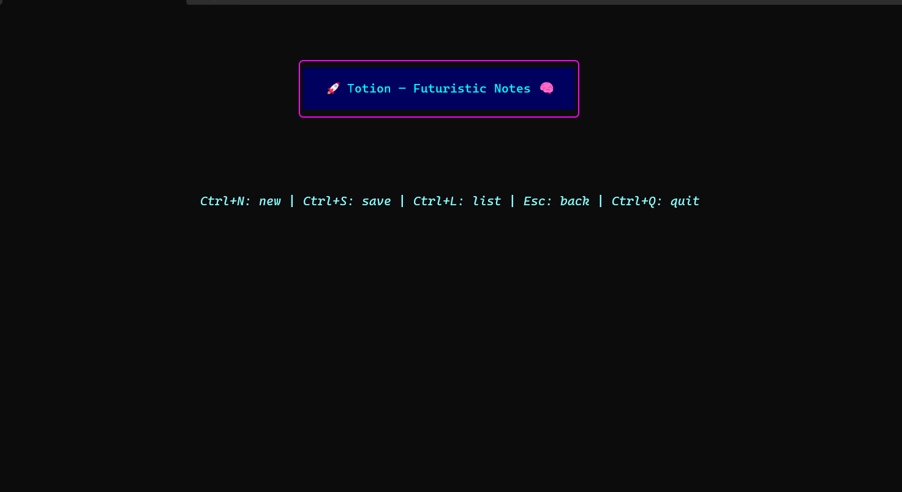
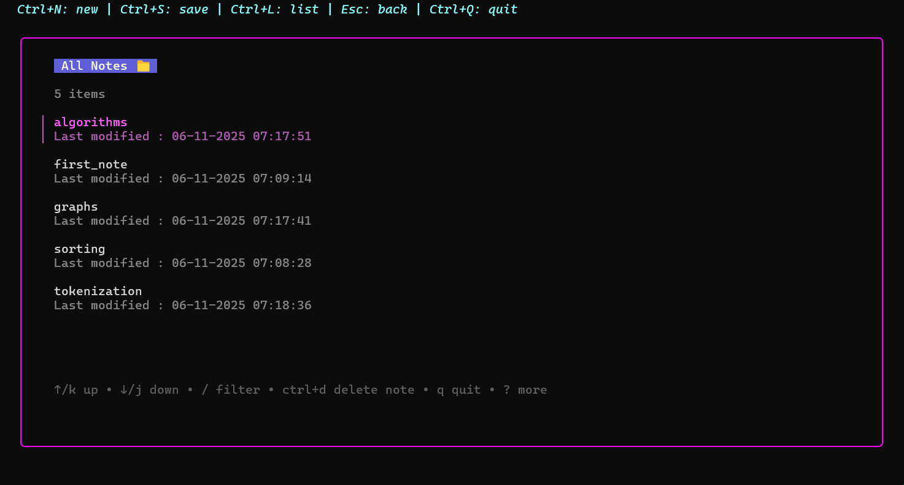

# 🚀 Totion — Futuristic Notes in Your Terminal 🧠

> A beautiful, cyberpunk-themed **terminal note-taking app** built with [Bubble Tea](https://github.com/charmbracelet/bubbletea).
> Write, save, and manage your notes — right inside your terminal, with glowing neon vibes. ⚡

---

## ✨ Features

- 📝 Create, view, and edit notes directly from your terminal
- 🗂️ List and manage all notes stored in your local vault (`~/.totion`)
- 🧠 Futuristic neon interface using [Lipgloss](https://github.com/charmbracelet/lipgloss)
- 💾 Auto-resizing editor window
- 🧹 Delete notes quickly with `Ctrl + D`
- ⚙️ Persistent storage — notes are saved as plain text files
- 🔥 Fully keyboard-driven experience

---

## 🎮 Keybindings

| Shortcut | Action |
|-----------|--------|
| `Ctrl + N` | Create a new note |
| `Enter` | Open note (in list) / Confirm filename |
| `Ctrl + S` | Save note |
| `Ctrl + L` | Open notes list |
| `Ctrl + D` | Delete selected note (in list view) |
| `Esc` | Go back / Close current view |
| `Ctrl + Q` or `Ctrl + C` | Quit the app |

---

## 🖼️ Screenshots

### 🚀 Startup Screen


### 🧠 Notes List


### 📝 Editor View


---

## ⚡ Installation

### 1️⃣ Clone this repository
```bash
git clone https://github.com/dibakarghosh03/tui-note-app.git
cd tui-note-app
```

### 2️⃣ Install dependencies

Make sure you have **Go 1.22+** installed.

```bash
go mod tidy
```

### 3️⃣ Run it
```bash
go run main.go
```

Your notes will be stored in:
```bash
~/.totion/
```

---

## 💡 Tech Stack

| Component | Purpose |
|------------|----------|
| [Bubble Tea](https://github.com/charmbracelet/bubbletea) | Terminal UI framework |
| [Lipgloss](https://github.com/charmbracelet/lipgloss) | Styling & layout |
| [Bubbles](https://github.com/charmbracelet/bubbles) | Text input, textarea, and list components |
| [Go](https://go.dev/) | Core language |

---

---

### 💜 Made with Go, Bubble Tea, and caffeine by [Dibakar Ghosh](https://github.com/dibakarghosh03)
